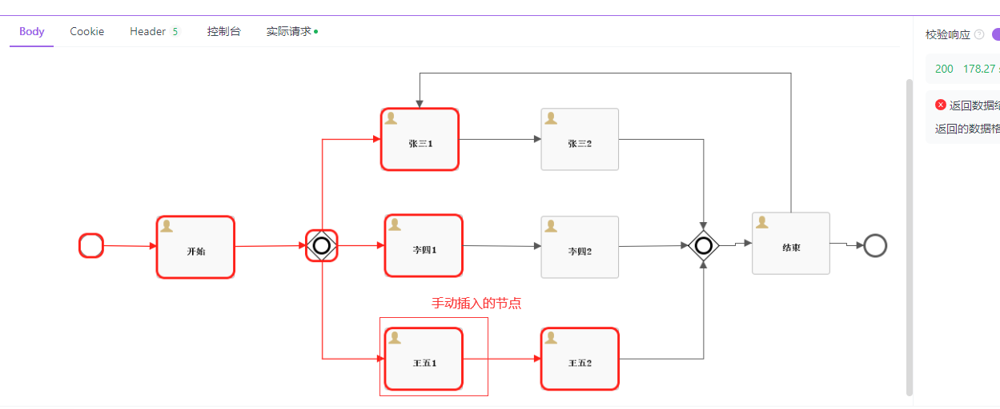

# flowable-demo

#### 介绍
flowable引擎使用demo

#### 手动插入节点操作
### 插入flowable.act_ru_execution，id为后续的EXECUTION_ID_
INSERT INTO flowable.act_ru_execution (ID_, REV_, PROC_INST_ID_, BUSINESS_KEY_, PARENT_ID_, PROC_DEF_ID_, SUPER_EXEC_, ROOT_PROC_INST_ID_, ACT_ID_, IS_ACTIVE_, IS_CONCURRENT_, IS_SCOPE_, IS_EVENT_SCOPE_, IS_MI_ROOT_, SUSPENSION_STATE_, CACHED_ENT_STATE_, TENANT_ID_, NAME_, START_ACT_ID_, START_TIME_, START_USER_ID_, LOCK_TIME_, IS_COUNT_ENABLED_, EVT_SUBSCR_COUNT_, TASK_COUNT_, JOB_COUNT_, TIMER_JOB_COUNT_, SUSP_JOB_COUNT_, DEADLETTER_JOB_COUNT_, VAR_COUNT_, ID_LINK_COUNT_, CALLBACK_ID_, CALLBACK_TYPE_)
VALUES ('4', 2, '1a04ef26-0135-11ef-a3d6-7486e22ccbe7', null, '1a04ef26-0135-11ef-a3d6-7486e22ccbe7', 'faten-back:3:70abe656-c0c8-11ee-9a38-7486e22ccbe7', null, '1a04ef26-0135-11ef-a3d6-7486e22ccbe7', 'sid-405B8985-D43C-4E83-9915-8258DC831C2A', 1, 0, 0, 0, 0, 1, null, 'default', null, null, '2024-04-23 13:38:27.000', null, null, 1, 0, 1, 0, 0, 0, 0, 0, 0, null, null);

### 插入运行节点和线
INSERT INTO flowable.act_ru_actinst (ID_, REV_, PROC_DEF_ID_, PROC_INST_ID_, EXECUTION_ID_, ACT_ID_, TASK_ID_, CALL_PROC_INST_ID_, ACT_NAME_, ACT_TYPE_, ASSIGNEE_, START_TIME_, END_TIME_, DURATION_, DELETE_REASON_, TENANT_ID_)
VALUES (uuid(), 1, 'faten-back:3:70abe656-c0c8-11ee-9a38-7486e22ccbe7', '1a04ef26-0135-11ef-a3d6-7486e22ccbe7', '4', 'sid-6947C36A-428E-45AA-932C-42E7733C6448', null, null, null, 'sequenceFlow', null, '2024-04-23 11:14:59.000', '2024-04-23 11:15:01.000', 0, null, 'default');
INSERT INTO flowable.act_ru_actinst (ID_, REV_, PROC_DEF_ID_, PROC_INST_ID_, EXECUTION_ID_, ACT_ID_, TASK_ID_, CALL_PROC_INST_ID_, ACT_NAME_, ACT_TYPE_, ASSIGNEE_, START_TIME_, END_TIME_, DURATION_, DELETE_REASON_, TENANT_ID_)
VALUES (uuid(), 1, 'faten-back:3:70abe656-c0c8-11ee-9a38-7486e22ccbe7', '1a04ef26-0135-11ef-a3d6-7486e22ccbe7', '4', 'sid-405B8985-D43C-4E83-9915-8258DC831C2A', '1', null, '王五1', 'userTask', 'userTask', '2024-04-23 11:16:27.000', '2024-04-23 11:16:32.000', 0, null, 'default');

### 插入任务
INSERT INTO flowable.act_ru_task (ID_, REV_, EXECUTION_ID_, PROC_INST_ID_, PROC_DEF_ID_, TASK_DEF_ID_, SCOPE_ID_, SUB_SCOPE_ID_, SCOPE_TYPE_, SCOPE_DEFINITION_ID_, NAME_, PARENT_TASK_ID_, DESCRIPTION_, TASK_DEF_KEY_, OWNER_, ASSIGNEE_, DELEGATION_, PRIORITY_, CREATE_TIME_, DUE_DATE_, CATEGORY_, SUSPENSION_STATE_, TENANT_ID_, FORM_KEY_, CLAIM_TIME_, IS_COUNT_ENABLED_, VAR_COUNT_, ID_LINK_COUNT_, SUB_TASK_COUNT_)
VALUES (uuid(), 1, '4', '1a04ef26-0135-11ef-a3d6-7486e22ccbe7', 'faten-back:3:70abe656-c0c8-11ee-9a38-7486e22ccbe7', null, null, null, null, null, '王五', null, null, 'sid-405B8985-D43C-4E83-9915-8258DC831C2A', null, 'wangwu', null, 50, '2024-04-23 11:18:17.000', null, null, 1, 'default', null, null, 1, null, null, null);

### 插入历史任务
INSERT INTO flowable.act_hi_taskinst (ID_, REV_, PROC_DEF_ID_, TASK_DEF_ID_, TASK_DEF_KEY_, PROC_INST_ID_, EXECUTION_ID_, SCOPE_ID_, SUB_SCOPE_ID_, SCOPE_TYPE_, SCOPE_DEFINITION_ID_, NAME_, PARENT_TASK_ID_, DESCRIPTION_, OWNER_, ASSIGNEE_, START_TIME_, CLAIM_TIME_, END_TIME_, DURATION_, DELETE_REASON_, PRIORITY_, DUE_DATE_, FORM_KEY_, CATEGORY_, TENANT_ID_, LAST_UPDATED_TIME_)
VALUES (uuid(), 2, 'faten-back:3:70abe656-c0c8-11ee-9a38-7486e22ccbe7', null, 'sid-405B8985-D43C-4E83-9915-8258DC831C2A', '1a04ef26-0135-11ef-a3d6-7486e22ccbe7', '4', null, null, null, null, '王五1', null, null, null, 'wangwu', '2024-04-23 11:22:46.000', null, null, null, null, 50, null, null, null, 'default', '2024-04-23 11:23:09.000');

### 历史运行节点和线
INSERT INTO flowable.act_hi_actinst (ID_, REV_, PROC_DEF_ID_, PROC_INST_ID_, EXECUTION_ID_, ACT_ID_, TASK_ID_, CALL_PROC_INST_ID_, ACT_NAME_, ACT_TYPE_, ASSIGNEE_, START_TIME_, END_TIME_, DURATION_, DELETE_REASON_, TENANT_ID_)
VALUES (uuid(), 1, 'faten-back:3:70abe656-c0c8-11ee-9a38-7486e22ccbe7', '1a04ef26-0135-11ef-a3d6-7486e22ccbe7', '4', 'sid-6947C36A-428E-45AA-932C-42E7733C6448', null, null, null, 'sequenceFlow', null, '2024-04-23 11:33:19.000', '2024-04-23 11:33:25.000', 0, null, 'default');
INSERT INTO flowable.act_hi_actinst (ID_, REV_, PROC_DEF_ID_, PROC_INST_ID_, EXECUTION_ID_, ACT_ID_, TASK_ID_, CALL_PROC_INST_ID_, ACT_NAME_, ACT_TYPE_, ASSIGNEE_, START_TIME_, END_TIME_, DURATION_, DELETE_REASON_, TENANT_ID_)
VALUES (uuid(), 1, 'faten-back:3:70abe656-c0c8-11ee-9a38-7486e22ccbe7', '1a04ef26-0135-11ef-a3d6-7486e22ccbe7', '4', 'sid-405B8985-D43C-4E83-9915-8258DC831C2A', '1', null, null, 'userTask', 'wangwu', '2024-04-23 11:34:47.000', '2024-04-23 11:34:55.000', null, null, 'default');
### 效果如图，原来只有张三1和李四1节点，执行完上面的效果后多个王五1

#### 安装教程

1.  xxxx
2.  xxxx
3.  xxxx

#### 使用说明

1.  xxxx
2.  xxxx
3.  xxxx

#### 参与贡献

1.  Fork 本仓库
2.  新建 Feat_xxx 分支
3.  提交代码
4.  新建 Pull Request

#### 特技

1.  使用 Readme\_XXX.md 来支持不同的语言，例如 Readme\_en.md, Readme\_zh.md
2.  Gitee 官方博客 [blog.gitee.com](https://blog.gitee.com)
3.  你可以 [https://gitee.com/explore](https://gitee.com/explore) 这个地址来了解 Gitee 上的优秀开源项目
4.  [GVP](https://gitee.com/gvp) 全称是 Gitee 最有价值开源项目，是综合评定出的优秀开源项目
5.  Gitee 官方提供的使用手册 [https://gitee.com/help](https://gitee.com/help)
6.  Gitee 封面人物是一档用来展示 Gitee 会员风采的栏目 [https://gitee.com/gitee-stars/](https://gitee.com/gitee-stars/)
